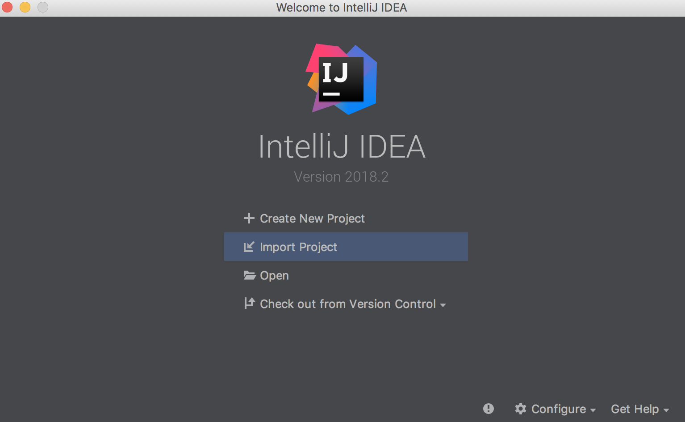
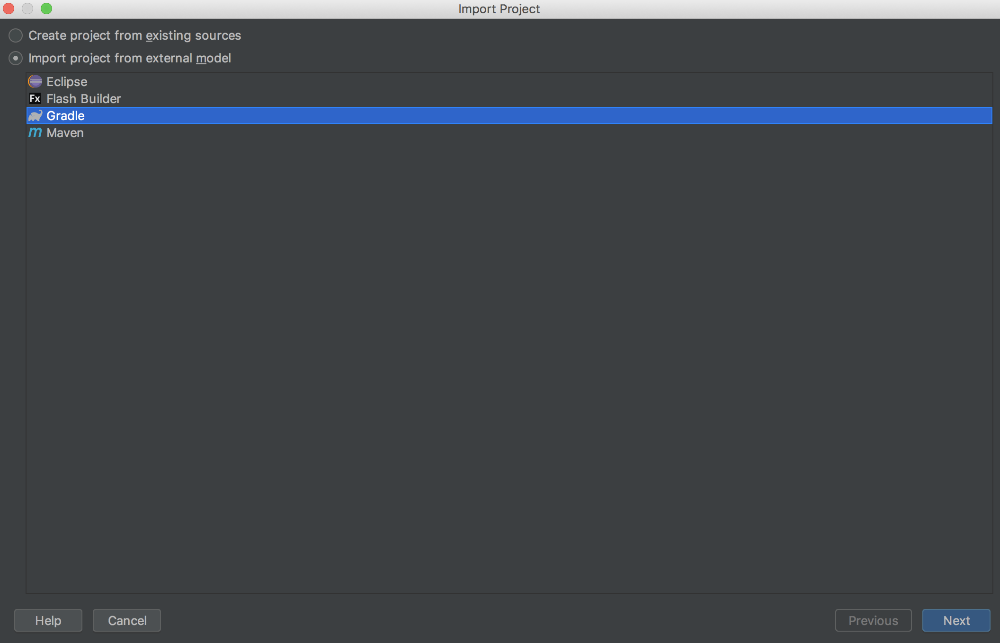
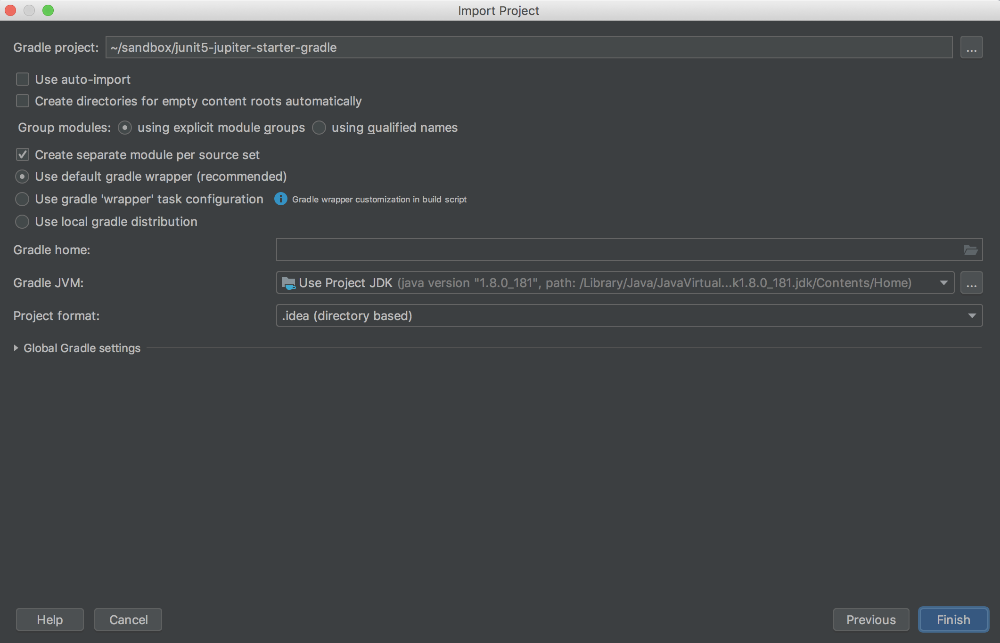
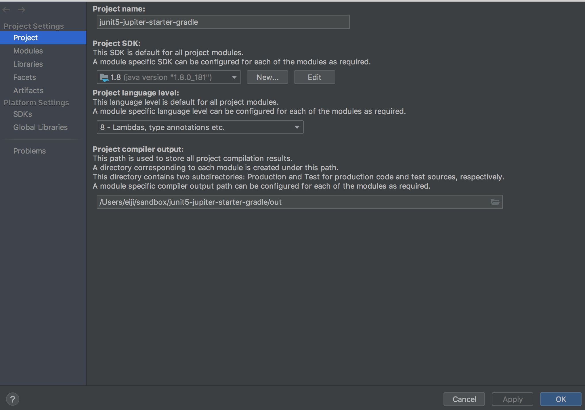
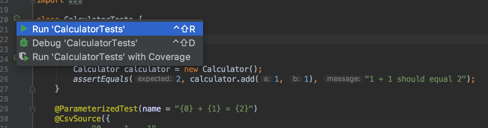

# プロジェクトをclone

# IntelliJで Gradleプロジェクトを Import する

* File -> Close Projectを選択し、"Welcome to IntelliJ IDE"画面を表示する

### Welcome to IntelliJ IDEA でImport Project



* "Import Project"を選択する
インポート対象は cloneした "junit5-jupiter-starter-gradle" を選択する。
（図は省略）

### Gradleを選択



* "Import project from external model" の Gradle を選択して Next　をクリック


#### Gradle JVM の設定を確認してFinish



Gradle JVMが設定されていることを確認しFinish
（指定がなければインストールしたJAVA_HOMEを設定）


# Project SDK の設定確認（未設定の場合のみ）

### メニューのFile -> Project Structure... を選択



Project の 「Project SDK」 で すでにインストールした JDK（JAVA_HOME） を設定する

# IntelliJから テストを実行する

### src/test/javaの com.example.project.CalculatorTestsを開く


class CalculatorTests 左横のグリーンボタンをクリックし ’Run CalculatorTests’を選択
Test All GreenならOK

# ターミナルからgradleでテスト実行

## windows

```
gradlew.bat clean test
```

## linux or mac

```
./gradlew clean test
```
